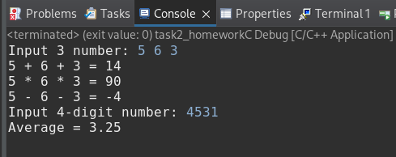

## Домашнее задание №2
## Задача 1. Сумма трех чисел
## Задача 2. Сумма и произведение трех чисел
## Задача 3. Разность двух чисел
Объединена с задачей 2
## Задача 4. Найти среднее арифметическое цифр 4-х значного числа

## Результат:
